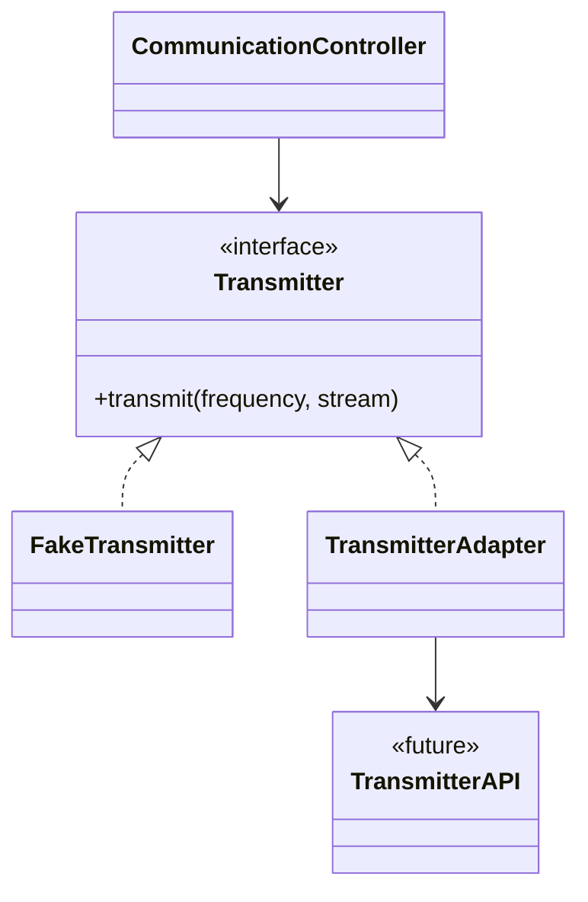

본 글은 '클린 코드(로버트.C.마틴)'를 정리한 글입니다.

---

시스템의 모든 코드를 직접 작성하는 경우는 드물다. 외부 라이브러리 혹은 사내 다른 팀에서 작성한 라이브러리를 사용할 때가 많다. 우리가 통제할 수 없는 외부 코드와 우리 코드가 만나는 지점을 경계라 한다.

자바 컬렉션도 외부 코드라고 볼 수 있다. 매우 안정적인 API인 것은 맞지만, 변경사항이 있을 경우 우리가 통제할 수 없다. 따라서 애플리케이션 코드에 돌아다니는 것을 막아주는 편이 좋다.

### 외부 코드 감싸기
외부 코드와 경계를 깔끔하게 처리할 수 있는 방법 중 하나는 래퍼 클래스를 만들어주는 것이다. [[일급 컬렉션]]이 이 기법을 적용한 것 중 하나로 볼 수 있다.

`Map`을 사용할 때, 우리는 List의 전체 기능을 사용하지는 않는다. 사용하지 않는다고 해서 사용할 수 없는 것은 아니기 때문에 언제든지 첫 사용 의도와는 멀어질 수 있다. 이때 래퍼 클래스로 감싸주면 원하는 동작만 통제할 수 있고, 만약 List가 변경 되더라도 변경에 의한 영향을 최대한으로 줄일 수 있다.


```Java
List<String, Pay> pays = new HashMap<>();

pays.clear() // 의도하지 않은 clear() 메서드를 호출할 수 있다
```

```Java
public class Pays {
	private List<Pay> pays;

	public Pays(List<Pay> pays) {
		this.pays = pays;
	}

	public Long sumAmount(PayType payType) {
		return pays.stream()
					.filter(pay, pay.getPayType() == payType)
					.mapToLong(Pay::getAmount)
					.sum();
	}
}
```

### 경계 살피고 익히기
외부에서 가져온 라이브러리를 사용하고 싶다면 먼저 문서를 읽고, **학습 테스트**를 해보는 것이 좋다.
Java 에서는 JUnit 테스트 프레임 워크를 사용한다. 테스트 코드로 학습을 진행하면 다른 프레임워크에 종속되지 않고 순수하게 테스트 하고자하는 라이브러리를 사용할 수 있다.

### 존재하지 않는 코드 사용하기
한 시스템을 만드는 여러 팀이 존재할 수 있다. 업무를 진행하는데 아직 다른 팀의 API가 구현되지 않는 경우도 있다. 이때는 경계를 인지하고 그 경계를 인터페이스로 추상화하면 우리쪽 코드를 작성할 수 있다.



`Transmitter API`는 아직 구현되지 않은 외부 API이다.
`CommunicationController`를 아직 구현되지 않은 API와 분리했다. `Transmitter` 인터페이스로 추상화 했으며, API 구현전에는 적절한 FakeTransmitter를 선택하여 테스트 할 수 있고, API가 구현되었다면 올바르게 동작하는지 확인하기 위해 `TransmitterAdapter`를 선택하여 사용할 수 있다.

[[어댑터 패턴]]을 사용해 경계를 깔끔하게 분리했다.