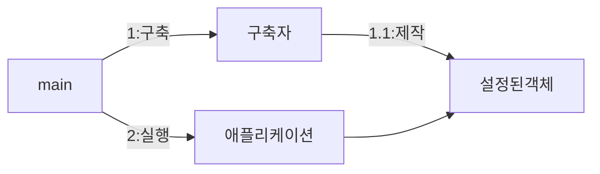
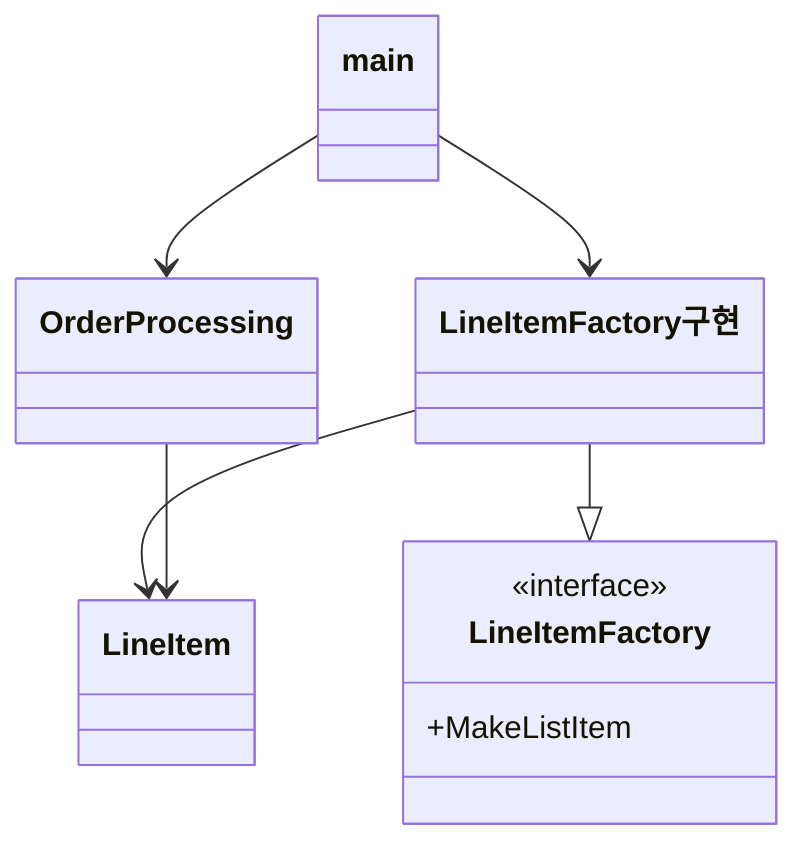

본 글은 '클린 코드(로버트.C.마틴)'를 정리한 글입니다.

---

깨끗한 시스템을 유지하는 방법을 살펴본다

### 제작과 사용의 분리
소프트웨어 시스템은 준비 과정(제작)과 런타임 로직(사용)을 분리해야 한다.

```Java
public class OrderService {
	private final UserService userService;

	public OrderService() {
		userService = new UserServiceImpl();
	}
}
```

`OrderService`는 내부 로직에 사용될 `UserService`의 구현체를 직접 생성하고 있다. 제작과 사용의 분리가 이루어지지 않으면 1. `UserService`의 인스턴스를 제어할 수 없고 2. 테스트도 어려워진다.

`UserService`의 새로운 구현체를 사용하기 위해서는 `OrderService`의 코드를 변경해야 하므로 [[OCP]]를 위반한다. 또한 `UserService` 인스턴스를 직접 생성할 책임도 가지고 있으므로 [[SRP]]를 위반한다. `OrderService`가 `UserServiceImpl`을 직접 알고 있으므로 [[DIP]]를 위반한다. 

체계적이고 탄탄한 시스템을 만들고 싶다면 모듈성을 깨서는 안된다. 설정 논리는 일반 실행 논리와 분리해야 모듈성이 높아진다.


#### Main 분리
생성과 관련된 설정논리를 main이나 main을 호출하는 모듈로 분리한다. 나머지 시스템은 모든 객체가 생성되었고 모든 의존성이 연결되었다고 가정한다.




main의 의존성 화살표가 모두 애플리케이션 쪽을 향한다. 애플리케이션은 main이나 객체가 생성되는 과정을 전혀 모른다

#### 팩토리
때로는 애플리케이션이 객체가 생성되는 시점을 결정할 필요가 생긴다. 예를들어, 주문 처리 시스템에서 애플리케이션은  LineItem 인스턴스를 Order에 추가한다. 이때 [[추상 팩토리 패턴]]을 사용한다. 



모든 의존성이 main에서 애플리케이션 쪽으로 향한다. OrderProcessing 애플리케이션은 LineItem이 생성되는 구체적인 방법을 모른다. 생성 방법은 main쪽에 있는 LineItemFactory구현이 알고있음에도, OrderProcessing이 객체 생성 시점을 완벽하게 통제한다.

#### 의존성 주입
[[의존성 주입]]은 [[제어 역전 기법]]을 의존성 관리에서 적용한 매커니즘이다. 제어 역전에서는 한 객체가 맡은 보조 책임을 새로운 객체에게 전적으로 떠넘긴다. 새로운 객체는 넘겨받은 책임만 맡으므로 [[SRP]]를 지키게 된다.

의존성 관리 맥락에서 객체는 의존성 자체를 인스턴스로 만드는 책임을 지지 않는다. 다른 이러한 책임을 다른 '전담' 매커니즘에 맡겨야 한다. 스프링은 컨테이너를 활용하여 의존성 주입으르 구현했다

### 확장
처음부터 올바르게 시스템을 만들 수 있다는 믿음은 미신이다. 하루하루 주어진 사용자 스토리에 맞춰 시스템을 구현해야 한다. 관심사를 적절히 분리하면 복잡한 시스템도 단순하게 시작해 점진적으로 발전해 나갈 수 있다.

설정과 실행은 서로 다른 관심사이다. 영속성 관리와 도메인 논리도 서로 다른 관심사이다. 관심사를 분리하여 모듈화 할 수 있다. 하지만 각 모듈에는 세밀한 단위로 겹치는 관심사가 있다. 예를들면, 트랜잭션이 시작하고 커밋 혹은 롤백 되는 것, 메서드 시작에 로그를 찍는 것 등이 있다.

이러한 관심사를 [[횡단 관심사]]라 한다. [[관점 지향 프로그래밍]](AOP)는 이러한 횡단 관심사를 분리해 모듈성을 확보하는 일반적인 방법론이다. 스프링은 프록시를 활용해 AOP를 구현했다.

### 도메인 특화 언어
[[도메인 특화 언어]]는 간단한 스크립트 언어나 표준 언어로 구현한 API를 말한다.

좋은 DSL은 도메인 개념과 그 개념을 구현한 코드 사이에 존재하는 의사소통 간극을 줄여준다. 효과적으로 개발된 DSL은 추상화 수준을 코드 관용구나 디자인 패턴 이상으로 끌어 올린다. DSL을 사용하면 고차원 정책에서 저차원 세부사항에 이르기까지 모든 추상화 수준과 도메인을 [[POJO]]로 표현할 수 있다.